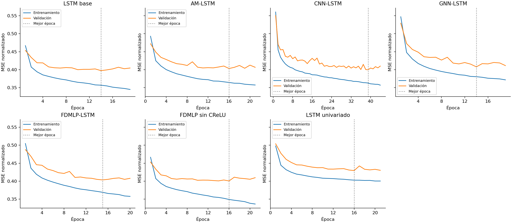
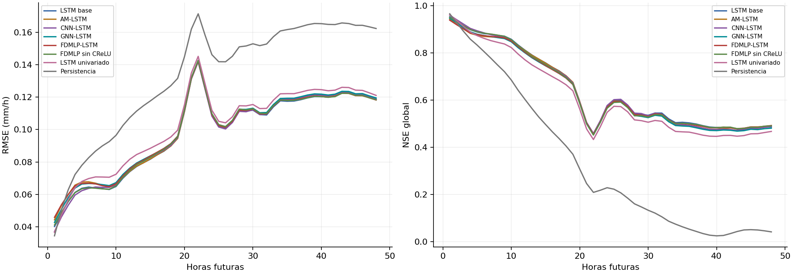
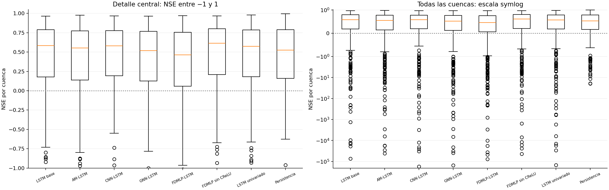
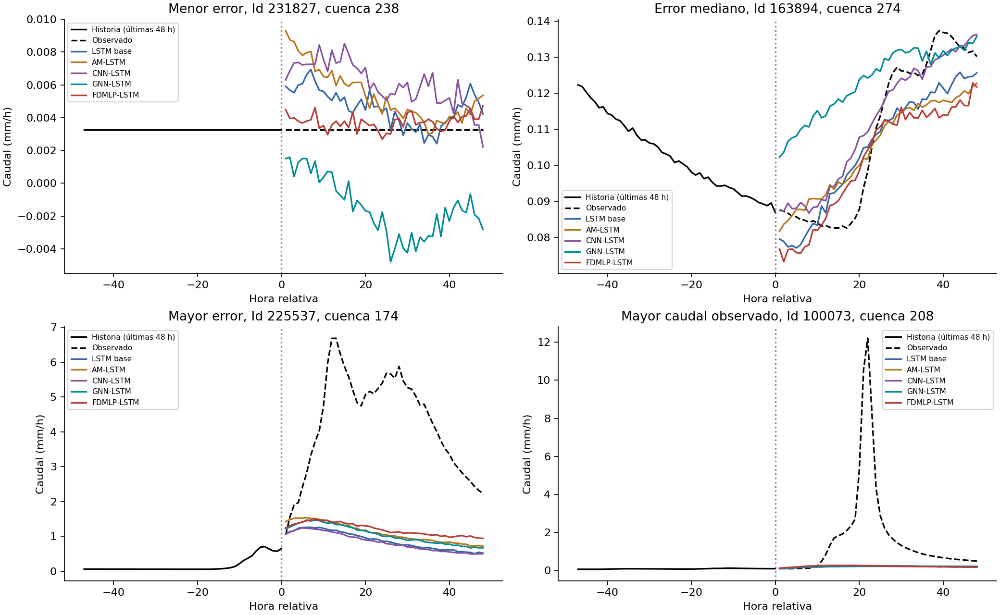
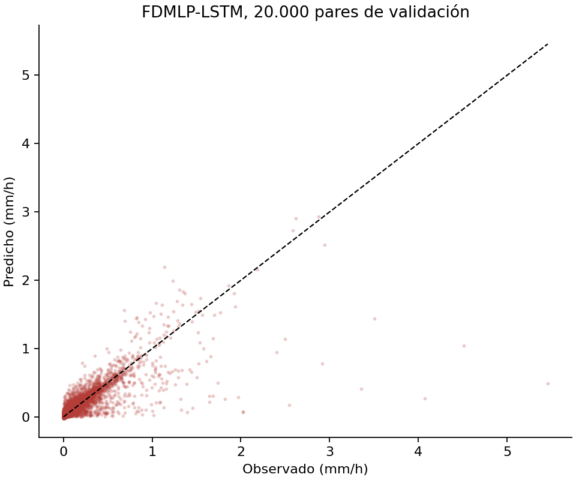
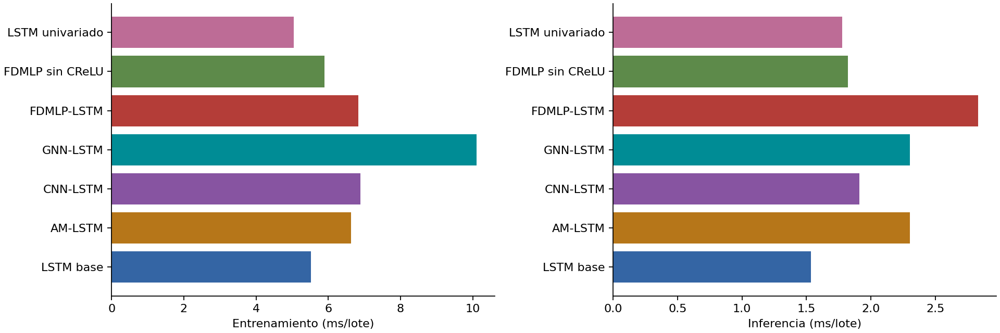
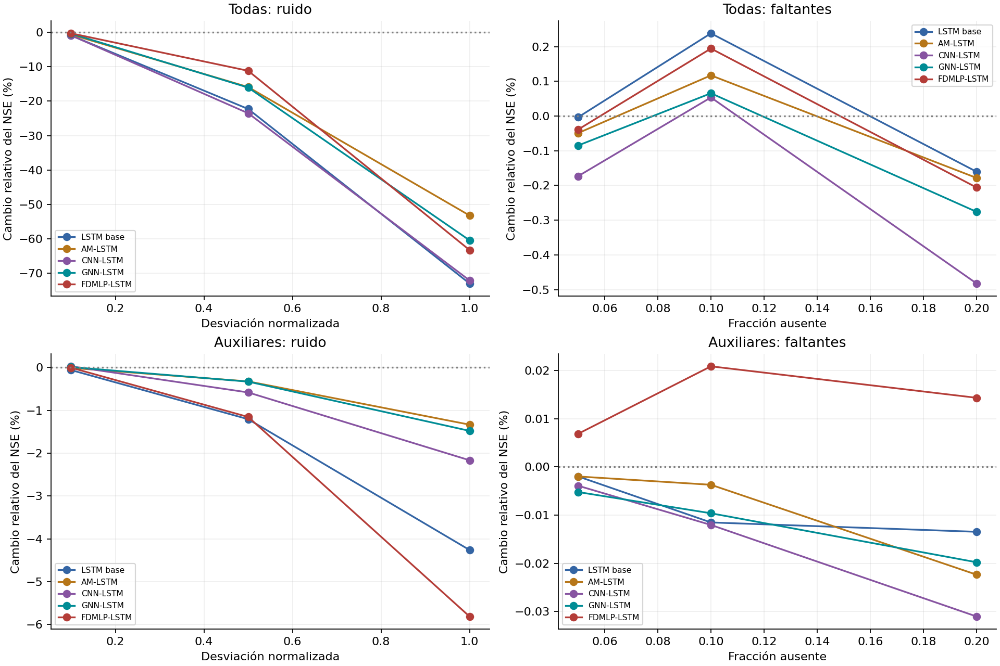
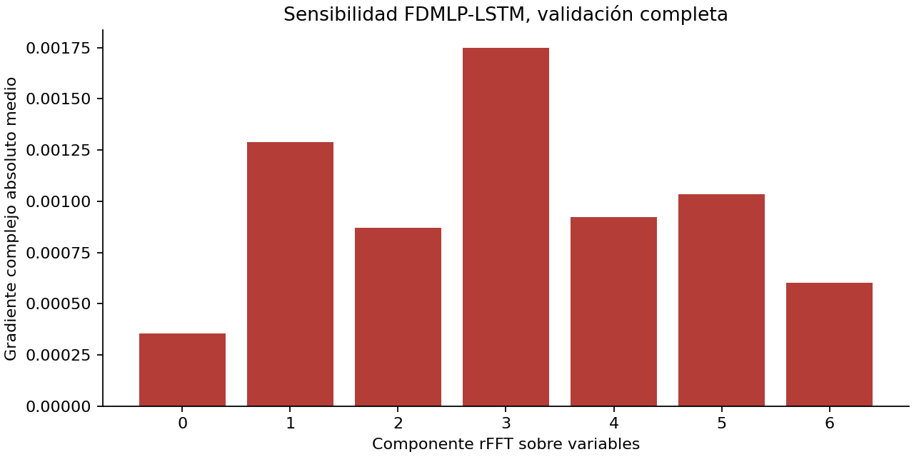

# Resultados del Laboratorio 2

Pronóstico horario de caudal, 336 horas históricas y 48 horas futuras, unidades mm/h.

## Protocolo

Se utilizaron 254,000 ventanas de entrenamiento y 18,142 de validación, respetando la partición entregada, las 508 cuencas están representadas en ambas. LASSO con validación cruzada de diez grupos de cuencas conservó 12 variables. La normalización y la selección se ajustaron únicamente en entrenamiento. Los objetivos de test no se utilizaron.

Se ejecutó una semilla. Los cinco modelos principales y la ablación comparten tamaño e inicialización del tronco LSTM, orden de lotes y política de entrenamiento. El control univariado conserva el tamaño oculto, con una sola variable de entrada y una matriz de entrada necesariamente diferente. La ablación conserva las capas complejas y elimina CReLU, el LSTM base retira todo FDMLP. Persistencia repite el último caudal observado. Los resultados no constituyen una prueba de significancia entre semillas.

## Comparación en validación

Métricas de predicciones crudas, calculadas en unidades originales sobre las 48 salidas de cada ventana. NSE global y R mezclan cuencas, por ello se incluye la mediana del NSE por cuenca. Las ventanas pueden solaparse y no representan necesariamente horas independientes.

| Modelo | RMSE (mm/h) | MAE (mm/h) | NSE global | R | Mediana NSE por cuenca |
|---|---:|---:|---:|---:|---:|
| LSTM base | 0.10159 | 0.02355 | 0.64952 | 0.80613 | 0.58224 |
| AM-LSTM | 0.10233 | 0.02543 | 0.64437 | 0.80362 | 0.55114 |
| CNN-LSTM | 0.10188 | 0.02424 | 0.64751 | 0.80531 | 0.58096 |
| GNN-LSTM | 0.10292 | 0.02595 | 0.64025 | 0.80017 | 0.51844 |
| FDMLP-LSTM | 0.10237 | 0.02707 | 0.64407 | 0.80286 | 0.46284 |
| FDMLP sin CReLU | 0.10200 | 0.02293 | 0.64666 | 0.80449 | 0.61399 |
| LSTM univariado | 0.10562 | 0.02549 | 0.62116 | 0.78908 | 0.57359 |
| Persistencia | 0.13786 | 0.02446 | 0.35455 | 0.69365 | 0.52509 |

El menor RMSE entre modelos entrenados corresponde a **LSTM base**. El FDMLP-LSTM presenta un **incremento del RMSE de 0.77%** respecto al LSTM base y un **incremento de 0.36%** respecto a la versión sin CReLU. Esta comparación evalúa la adaptación implementada, no reproduce los valores del dataset original del paper.

El ranking depende del criterio: FDMLP sin CReLU obtiene el menor MAE y FDMLP sin CReLU la mayor mediana de NSE por cuenca. Una ventaja en RMSE global no implica ser mejor en todas las cuencas o para todos los tamaños de error.

El NSE global puede ocultar errores en cuencas de caudal pequeño. La siguiente tabla conserva la media aritmética, sensible a cuencas con variabilidad casi nula, junto con el número de cuencas con NSE positivo. No se excluyen cuencas para mejorar el resumen.

| Modelo | Media NSE por cuenca | Cuencas con NSE > 0 | Peor NSE por cuenca |
|---|---:|---:|---:|
| LSTM base | -260.72985 | 430/508 | -73372.35358 |
| AM-LSTM | -230.89082 | 413/508 | -41870.16240 |
| CNN-LSTM | -534.75382 | 435/508 | -173525.60944 |
| GNN-LSTM | -510.66370 | 422/508 | -154207.52546 |
| FDMLP-LSTM | -384.18029 | 401/508 | -77764.56977 |
| FDMLP sin CReLU | -209.62558 | 433/508 | -44426.96546 |
| LSTM univariado | -432.71158 | 437/508 | -149059.00411 |
| Persistencia | 0.22925 | 433/508 | -19.37887 |

El peor NSE del FDMLP-LSTM corresponde a la cuenca 369: -77764.57, con RMSE 0.006153 mm/h y desviación observada 0.00002207 mm/h. Al dividir por una varianza pequeña, NSE amplifica errores que parecen pequeños en unidades absolutas; el resultado indica una predicción deficiente respecto a la media observada de esa cuenca.

FDMLP-LSTM obtiene menor RMSE que el LSTM base en 138/508 cuencas y que la ablación en 139/508. Son comparaciones descriptivas de esta ejecución, no pruebas estadísticas con muestras independientes.

## Coste y selección de modelos

| Modelo | Parámetros | Épocas ejecutadas | Mejor época | Entrenamiento total (min) | Inferencia validación (s) |
|---|---:|---:|---:|---:|---:|
| LSTM base | 210,992 | 19 | 14 | 14.87 | 4.83 |
| AM-LSTM | 223,680 | 21 | 16 | 12.73 | 6.43 |
| CNN-LSTM | 212,284 | 44 | 39 | 21.54 | 6.57 |
| GNN-LSTM | 211,168 | 19 | 14 | 12.99 | 6.35 |
| FDMLP-LSTM | 211,048 | 20 | 15 | 26.89 | 5.37 |
| FDMLP sin CReLU | 211,048 | 21 | 16 | 26.27 | 5.53 |
| LSTM univariado | 205,360 | 21 | 16 | 9.75 | 5.99 |

Los tiempos incluyen lectura y transferencias. Durante la ejecución hubo otras aplicaciones que compartieron RAM y GPU; la variación de carga impide interpretar diferencias de tiempo entre variantes como diferencias intrínsecas de eficiencia. Tampoco son una comparación controlada con la RTX 3090 del paper. Los pilotos tienen calentamiento desigual y no se usan para afirmar superioridad computacional.

## Errores y extremos

Se muestran automáticamente cuatro ventanas de validación, elegidas por menor, mediano y mayor error del FDMLP-LSTM, y por mayor caudal observado. Se visualizan las últimas 48 horas del historial, aunque el modelo recibe las 336. La selección se guarda con sus identificadores para poder reproducirla.

| Modelo | RMSE caudales altos | Sesgo volumen altos (%) | RMSE caudales bajos | Sesgo volumen bajos (%) |
|---|---:|---:|---:|---:|
| LSTM base | 0.67136 | -27.04120 | 0.00970 | 17.36427 |
| AM-LSTM | 0.67020 | -22.94443 | 0.01238 | 324.88192 |
| CNN-LSTM | 0.67914 | -29.28072 | 0.01081 | 294.37266 |
| GNN-LSTM | 0.68095 | -27.62726 | 0.01120 | 151.96355 |
| FDMLP-LSTM | 0.66688 | -25.66611 | 0.01398 | 266.42040 |
| FDMLP sin CReLU | 0.67196 | -24.42002 | 0.00977 | 84.72748 |
| LSTM univariado | 0.70418 | -31.16588 | 0.00952 | 325.14525 |
| Persistencia | 0.87494 | -15.78408 | 0.00858 | 11.52080 |

Altos y bajos se definen con los percentiles 98 y 30 de las observaciones de validación, respectivamente, y se conservan exactamente las mismas máscaras para todos los modelos. El sesgo es 100 × suma(predicción − observación) / suma(observación). La suma de caudales específicos de ventanas posiblemente solapadas no representa un volumen físico total en m³. Estos diagnósticos condicionales no se presentan como una reproducción exacta de FHV/FLV. Los valores indefinidos no se reemplazan por cero.

FDMLP-LSTM subestima la suma de los caudales altos en un 25.67%. Su RMSE a una hora es 0.04581 mm/h y a 48 horas es 0.11824 mm/h. El entrenamiento con MSE global pondera fuertemente los errores grandes; estas métricas complementarias permiten detectar limitaciones en extremos y en los plazos más largos.

En la ventana Id 100073, el mayor pico observado alcanza 12.208 mm/h a 22 horas, mientras FDMLP-LSTM predice 0.246 mm/h en ese instante. La figura permite comparar la respuesta de los cinco modelos a esta crecida. No se dispone de meteorología futura, y el caudal histórico mostrado por sí solo no describe la magnitud del pico posterior; no se atribuye su causa física sin fechas y contexto meteorológico.

En el grupo de caudales bajos, el sesgo medio del FDMLP-LSTM es 0.007405 mm/h y su sesgo relativo es 266.42%. Los denominadores pequeños amplifican los porcentajes, por lo que deben interpretarse junto con RMSE y sesgo absoluto. La mediana de NSE por cuenca y las ventanas casi constantes también evidencian limitaciones que el RMSE global atenúa.

## Restricción de caudal no negativo

| Modelo | Predicciones negativas (%) | RMSE crudo | RMSE después del recorte a cero |
|---|---:|---:|---:|
| LSTM base | 12.29 | 0.10159 | 0.10155 |
| AM-LSTM | 0.69 | 0.10233 | 0.10233 |
| CNN-LSTM | 0.25 | 0.10188 | 0.10188 |
| GNN-LSTM | 8.60 | 0.10292 | 0.10289 |
| FDMLP-LSTM | 3.58 | 0.10237 | 0.10236 |
| FDMLP sin CReLU | 8.52 | 0.10200 | 0.10198 |
| LSTM univariado | 0.05 | 0.10562 | 0.10562 |

El recorte físico se declara por separado y no interviene en la selección de checkpoints. Como los objetivos son no negativos, el recorte no puede aumentar el error cuadrático de una predicción negativa; tampoco resuelve los errores de magnitud o de anticipación de crecidas.

## Predicciones finales y limitaciones

El archivo principal es `resultados/fdmlp/predicciones_test.csv`, con Id y q_01…q_48, 27.983 filas en el orden original, en mm/h. Se aplica máximo(predicción, 0) únicamente para imponer caudales no negativos, se conservan los valores crudos y también las métricas de validación con y sin ese recorte. Las predicciones de los comparadores se conservan en sus respectivas carpetas.

Las limitaciones principales son la ausencia de fechas y coordenadas, la falta de los hiperparámetros del suplemento y la realización de una sola semilla. No se puede certificar independencia temporal entre particiones ni comparar numéricamente RMSE en mm/h con el RMSE en m³/s del paper. La FFT describe el eje de variables, su frecuencia depende del orden de canales y no debe interpretarse directamente como periodicidad temporal o causalidad hidrológica.

Las adaptaciones, ecuaciones y comandos de reproducción se documentan en README.md. No se generaron matrices de confusión porque este problema es de regresión.

## Comparación experimental ampliada

Los cinco modelos del artículo se adaptan al mismo pronóstico de 48 horas. Se evalúan prefijos de 12, 24 y 48 horas del mismo modelo, y cada hora por separado. No son tres modelos reentrenados con horizontes distintos, ni equivalen a los 1, 3 y 5 días del artículo. La ventana de 336 horas y la salida de 48 horas se mantienen por la consigna y los datos disponibles.

Las arquitecturas, las adaptaciones y su justificación se detallan en ADAPTACIONES.md. No se hizo una búsqueda de hiperparámetros distinta para favorecer a un modelo, se compara una configuración común de referencia, sin afirmar que sea óptima para cada familia.

### Precisión por plazo

| Modelo | RMSE 1–12 h | RMSE 1–24 h | RMSE 1–48 h | NSE 1–48 h |
|---|---:|---:|---:|---:|
| LSTM base | 0.06167 | 0.08508 | 0.10159 | 0.64952 |
| AM-LSTM | 0.06428 | 0.08604 | 0.10233 | 0.64437 |
| CNN-LSTM | 0.06149 | 0.08515 | 0.10188 | 0.64751 |
| GNN-LSTM | 0.06410 | 0.08662 | 0.10292 | 0.64025 |
| FDMLP-LSTM | 0.06447 | 0.08667 | 0.10237 | 0.64407 |
| FDMLP sin CReLU | 0.06186 | 0.08567 | 0.10200 | 0.64666 |
| LSTM univariado | 0.06663 | 0.08971 | 0.10562 | 0.62116 |
| Persistencia | 0.08232 | 0.11314 | 0.13786 | 0.35455 |

### Caudales extremos: curvas de duración

FHV compara el 2% superior de las curvas ordenadas de observaciones y predicciones. FLV compara la forma logarítmica del 30% inferior, con signo según la convención de Yilmaz et al. Se calculan sobre caudales no negativos, con un suelo de 10⁻⁶ mm/h para los logaritmos. No son los diagnósticos condicionales de la sección anterior y no requieren emparejar los picos por fecha.

Definiciones: [NeuralHydrology, FHV y FLV](https://neuralhydrology.readthedocs.io/en/latest/api/neuralhydrology.evaluation.metrics.html). Se implementaron las fórmulas sin incorporar esa biblioteca ni reutilizar modelos externos. Dado que faltan los detalles del suplemento, se declara esta convención explícita y no una identidad exacta con los valores de los autores.

| Modelo | FHV global (%) | FLV global (%) | Mediana FHV por cuenca | Mediana FLV por cuenca | Cuencas con FLV definido |
|---|---:|---:|---:|---:|---:|
| LSTM base | -18.00201 | 26.47623 | -10.27288 | -491.90444 | 481/508 |
| AM-LSTM | -12.85852 | -37.02319 | -7.58575 | -108.25589 | 481/508 |
| CNN-LSTM | -20.70463 | -37.70239 | -10.16919 | -106.87770 | 481/508 |
| GNN-LSTM | -18.50693 | 6.33683 | -9.93538 | -617.35005 | 481/508 |
| FDMLP-LSTM | -16.69461 | -17.34754 | -5.35937 | -787.65483 | 481/508 |
| FDMLP sin CReLU | -14.47708 | 7.98193 | -10.61774 | -426.41600 | 481/508 |
| LSTM univariado | -20.89416 | -43.68404 | -9.28286 | -25.74658 | 481/508 |
| Persistencia | 3.11237 | 0.06126 | -4.01492 | 9.65465 | 481/508 |

Se conserva sensibilidad de FLV a su suelo logarítmico en `resultados/sensibilidad_FLV.csv`. Los casos con denominador cero se declaran indefinidos. Como existen ceros y ventanas posiblemente solapadas, estas curvas son diagnósticos de los ejemplos evaluados, no curvas de una serie continua reconstruida.

### Una variable frente a múltiples variables

El LSTM univariado usa únicamente caudal histórico. Su RMSE es 0.10562 mm/h, frente a 0.10159 mm/h con las doce variables. El cambio favorable al añadir meteorología es 3.82% (un valor negativo indica empeoramiento). Se mantienen datos, normalización del objetivo, tamaño oculto y parada temprana. La diferencia de parámetros de entrada es inherente a cambiar de una a doce variables.

### Coste con carga equivalente

Medianas de 20 repeticiones, después de cinco de calentamiento, lote fijo de 64, datos residentes en GPU y sin lectura de disco. Los pasos de entrenamiento se ejecutan sobre copias que se descartan, sin modificar checkpoints. Esta medición reduce la influencia de los distintos números de épocas y del acceso a archivos, aunque otras aplicaciones aún pueden afectar al hardware.

| Modelo | Parámetros | Entrenamiento por lote (ms) | Inferencia por lote (ms) | Memoria máxima asignada (MiB) |
|---|---:|---:|---:|---:|
| LSTM base | 210992 | 5.524 | 1.536 | 250.23828 |
| AM-LSTM | 223680 | 6.627 | 2.301 | 271.26074 |
| CNN-LSTM | 212284 | 6.887 | 1.912 | 273.40723 |
| GNN-LSTM | 211168 | 10.112 | 2.302 | 300.21680 |
| FDMLP-LSTM | 211048 | 6.836 | 2.833 | 253.69531 |
| FDMLP sin CReLU | 211048 | 5.899 | 1.822 | 253.69531 |
| LSTM univariado | 205360 | 5.045 | 1.779 | 247.90723 |

En esta medición, FDMLP-LSTM requiere 6.84 ms por lote de entrenamiento y 2.83 ms de inferencia, frente a 5.52 y 1.54 ms del LSTM base. El pequeño incremento de parámetros no garantiza una ejecución más rápida: también intervienen FFT, conversiones de precisión y operaciones intermedias. Estos tiempos describen esta implementación y este equipo.

### Robustez ante ruido y faltantes

Se evalúan las 18.142 ventanas de validación, sin reentrenar los modelos. Se añade ruido gaussiano de desviación 0,1, 0,5 y 1,0 en unidades normalizadas, o se elimina el 5%, 10% y 20% de los valores históricos y se interpola dentro de la historia. Se repite para todos los canales y para los auxiliares [1, 6, 3], elegidos por magnitud de coeficiente LASSO únicamente en entrenamiento. Las mismas realizaciones aleatorias se aplican a los cinco modelos, y los niveles comparten ruido y máscaras anidadas.

La interpolación utiliza exclusivamente las 336 horas de entrada, con el vecino más próximo en los extremos. Un caso completamente ausente se rellena con la media de entrenamiento. Las horas futuras nunca intervienen. El artículo estudia principalmente FDMLP, aquí se incluyen los cinco modelos para contrastar la robustez bajo idénticas perturbaciones.

| Modelo | ΔNSE (%) ruido σ=1, todos | ΔNSE (%) faltantes 20%, todos |
|---|---:|---:|
| LSTM base | -72.92218 | -0.16043 |
| AM-LSTM | -53.18667 | -0.17826 |
| CNN-LSTM | -72.03363 | -0.48238 |
| GNN-LSTM | -60.39126 | -0.27596 |
| FDMLP-LSTM | -63.21797 | -0.20589 |

Con ruido σ=1 en todos los canales, AM-LSTM presenta la menor caída relativa del NSE. Para FDMLP-LSTM, el cambio es -63.22% con ese ruido y -0.21% con un 20% de faltantes interpolados. La resistencia a faltantes interpolables no implica resistencia al ruido intenso. No se observa una superioridad general de FDMLP en robustez; las diferencias de escala del ruido, variables y protocolo impiden equiparar directamente estos porcentajes con los del artículo.

### Sensibilidad de componentes frecuenciales

Se calcula el gradiente absoluto complejo de la pérdida respecto a cada componente rFFT, en FP32 y sobre toda la validación. La pérdida es MSE por muestra para evitar que el tamaño del último lote cambie la escala del gradiente. Es una medida de sensibilidad local del modelo entrenado, no una demostración de causalidad.

La componente con mayor sensibilidad es el bin 3. Hay siete componentes porque se transforman directamente doce variables reales. No deben interpretarse como ciclos temporales ni trasladarse automáticamente las interpretaciones físicas de frecuencias bajas del artículo, el orden y la representación de los canales son distintos.

## Contraste con las conclusiones del paper

La tabla 3 del artículo se transcribió en `data/paper_rmse.csv`. Según sus valores de RMSE, FDMLP-LSTM obtiene el menor error en siete de nueve combinaciones estación–horizonte y CNN-LSTM en las otras dos. Ese recuento se refiere a los números de la tabla, dado que algunos pasajes narrativos del artículo presentan discrepancias.

En nuestro conjunto, el menor RMSE global entre los cinco modelos principales corresponde a **LSTM base**. FDMLP-LSTM cambia el RMSE del LSTM base en 0.77% (positivo significa mayor error). Por tanto, el ranking observado no reproduce la ventaja global del modelo propuesto en el artículo.

| Modelo | Casos del paper con menor RMSE (de 9) | Nuestro RMSE 48 h | Cambio RMSE frente a LSTM (%) |
|---|---:|---:|---:|
| LSTM base | 0 | 0.10159 | 0.00 |
| AM-LSTM | 0 | 0.10233 | 0.73 |
| CNN-LSTM | 2 | 0.10188 | 0.29 |
| GNN-LSTM | 0 | 0.10292 | 1.31 |
| FDMLP-LSTM | 7 | 0.10237 | 0.77 |

Se comparan rankings, cambios relativos y patrones de error, no valores absolutos entre m³/s diarios del paper y mm/h horarios del laboratorio. También difieren estaciones, número de cuencas, variables, tamaño de los modelos, ventanas, objetivos y protocolo de evaluación. Un resultado distinto no refuta el paper ni prueba que un modelo sea universalmente superior.

Las tablas anteriores separan precisión, extremos, robustez y coste: el mejor resultado en una dimensión no implica ser el mejor en las demás. El protocolo utiliza una semilla y una configuración fijada antes de ver los resultados nuevos, no una búsqueda exhaustiva de la mejor arquitectura de cada familia.

La validación también se empleó para seleccionar checkpoints y detener el entrenamiento, por lo que estos resultados pueden ser optimistas respecto a una evaluación independiente. Las predicciones de test se exportan, pero sus etiquetas no se han utilizado para obtener métricas. Sin fechas originales tampoco puede certificarse independencia temporal entre las particiones.

El uso de múltiples variables reduce el RMSE del LSTM en 3.82% respecto al control univariado, lo que coincide en dirección con el beneficio de información adicional estudiado en el paper. Esa coincidencia no se extiende automáticamente a la ventaja del módulo frecuencial.
